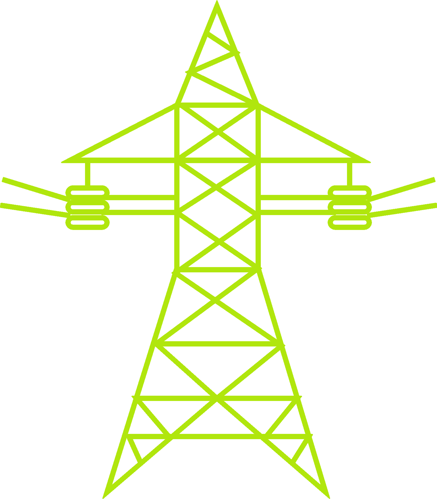
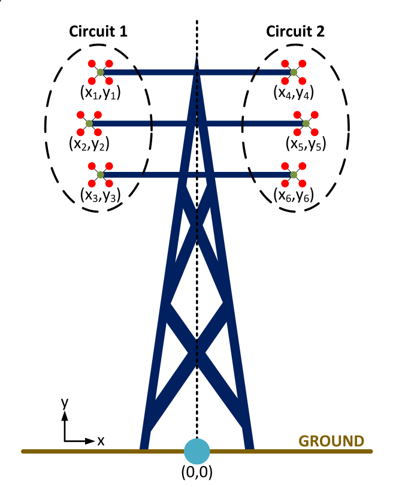
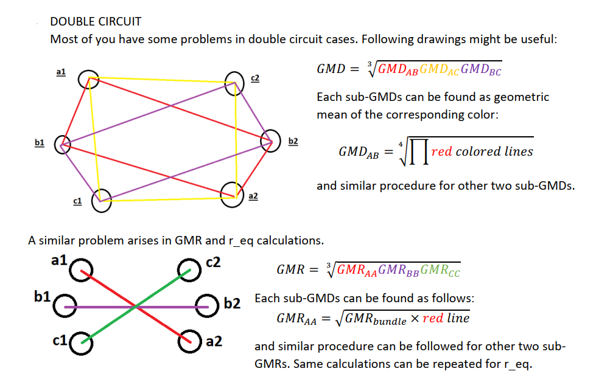
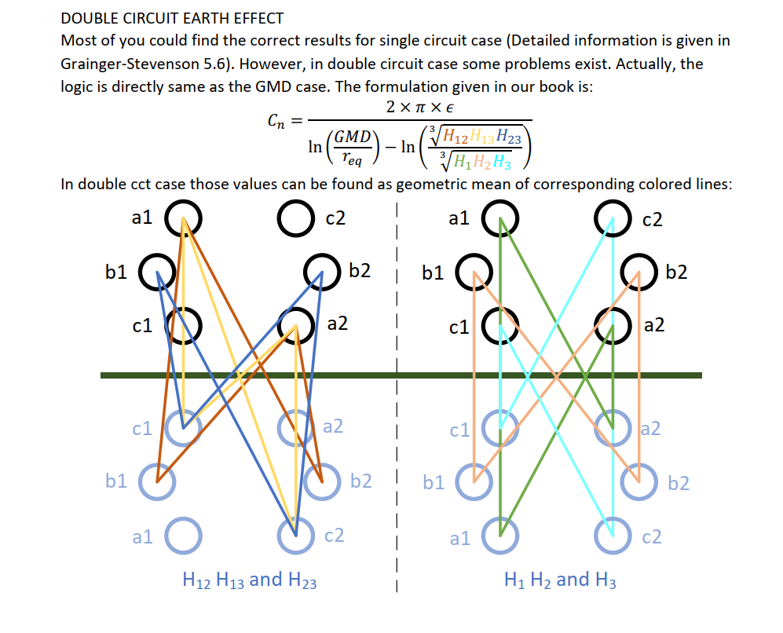
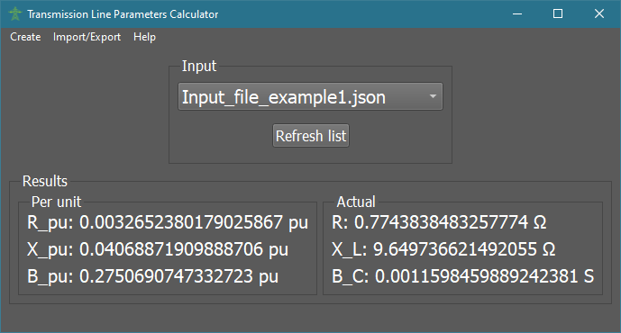
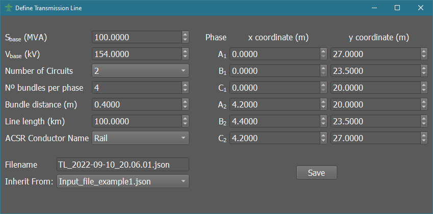
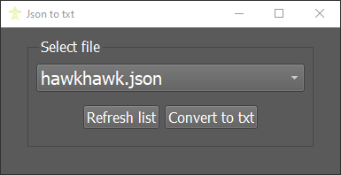
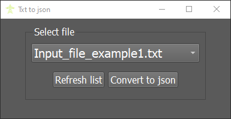

# Transmission Line Parameter Calculator
&nbsp;&nbsp;&nbsp;&nbsp;This project is originally given as term project for [EE374](https://catalog.metu.edu.tr/course.php?course_code=5670374) course. In school, this project was implemented on MATLAB. However, after end of the course, I decided to implement this project on Python and extended its features.

&nbsp;&nbsp;&nbsp;&nbsp;Calculate the R, X, and B parameters of a transmission line according to the configuration that the user provides.

 
 </img>
  

[Demo on YouTube](https://www.youtube.com/)

# App Specificatons
- Built-in file generator
- Compact .json storage format
- Compatible with METU .txt format
- Built-in format converter
- Auto-calculate after file creation & conversion to .json
- Metric (SI) unit output
- Conductor library from METU
- User-friendly 

# Background Info About Transmission Lines [copied from METU course document]
&nbsp;&nbsp;&nbsp;&nbsp;Following lines presents the project definition of the EE 374 Fundamentals of Power Systems
and Electrical Equipment course.

&nbsp;&nbsp;&nbsp;&nbsp;Electricity is generated in bulk and transmitted to consumption areas via HV overhead lines.
Therefore, the selection of transmission line and tower plays an important role in transmission
system planning. Geometry of the conductor positions plays an important role in the calculation
of electrical parameters of a transmission line.

- The purpose of colorful spheres or cone shaped indicators in transmission lines are to
inform helicopter pilots about transmission lines.
- The purpose of the shape of insulators is to make the surface flashover path longer.
- The purpose of ground wires is to protect the phase conductors from lightning strokes.
Also, they provide a path for return currents.
- The higher the system voltage, the longer the insulator length.

&nbsp;&nbsp;&nbsp;&nbsp;As you expect, there are more parameters that can affect the design of a tower; however,
those are out of scope of this course. In this project, you will need only basic parameters as
input that are listed here:
- Number of circuits
- Number of bundle conductors, where bundles form a regular polygon
- Bundle distance, which is the length of the edges of the polygon that a bundles forms (in
m)
- Length of the line (in km)
- Name of the ACSR conductor
- Location of the phases with respect to the origin
- A library of ACSR conductors and their parameters

&nbsp;&nbsp;&nbsp;&nbsp;Note that the library parameters will be given in Imperial Unit System and you should
convert those values to SI units. Also, note that the system is 50 Hz. With these raw input
parameters, we expect students write a function to calculate the electrical parameters of a line
in per unit. To compute these parameters, Geometric Mean Distance (GMD), Geometric Mean
Radius (GMR) of the line are found first.

# Assumptions & Limitations
- Works only on 3-phase systems (no single-phase systems)
- All phases consist of the same bundle orientation and same type of conductors
- Lines are transposed. The transposition rule is as follows.

| Transposition cycle | Position 1 | Position 2  | Position 3 |
| ----------- | ----------- | ----------- | ----------- | 
| 1 | Phase A | Phase B | Phase C |
| 2 | Phase C | Phase A | Phase B |
| 3 | Phase B | Phase C | Phase A |

- If double circuits are used, they will have the same conductor types and length.

# Coordinates

# Important Points in Calculation

# Images

